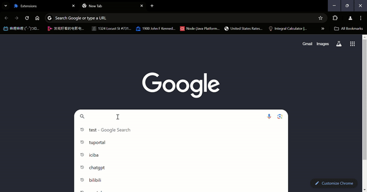

# HiEmoji

HiEmoji😋 is a simple browser extension that displays random emoji pop-ups whenever a user types certain characters into text inputs. The extension provides a fun and interactive experience by showing animated emojis as users interact with input fields on any website.

## SetUp 🎇

1. Download or clone this repository by pasting this command `git clone https://github.com/HarrryHe/HiEmoji.git`.
2. Open your Chrome browser and navigate to `chrome://extensions/` ***or*** Clicking the manage extensions icon, which is located in the Chrome toolbar.
3. Enable Developer mode in the top-right corner.
4. Click Load unpacked and select the directory where you saved the HiEmoji project.
5. Once loaded, the extension will be active and ready to trigger emojis on text inputs across most of the websites.

## How to Use 🧐❓

Once the extension is installed, it automatically runs in the background whenever you're on any website. Simply start typing in a text input field or textarea, and you’ll see a fun emoji pop up on your screen!

### Customization

+ **Emoji List**: You can add more emojis or customize the existing ones by modifying the emojis array in `content.js`.

>const emojis = ['😄', '😂', '😍', '😊', '😎', '😜', '🤔', '😢', '😡', '😱', '😇', '🤠', '😏', '🥳'];

- **Timer**: You can adjust the duration of the animations by modifying the `setTimeout` calls inside each functions.

## Sample Demo

## Contribution ❤️

Feel free to fork the project and submit pull requests if you’d like to improve the extension or add new features!

